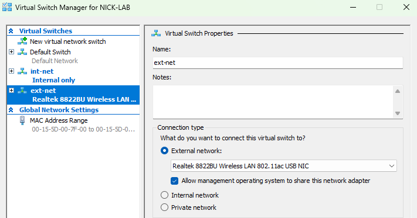
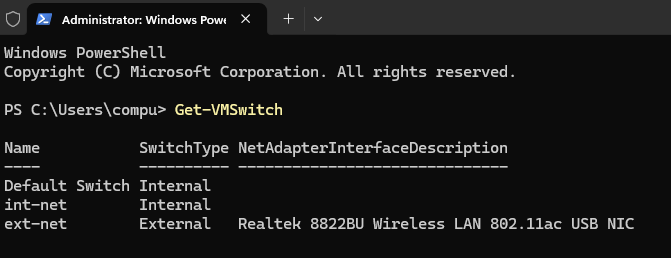

# Step 2: Creating Virtual Switches

## Goal
To set up the virtual networking that the lab's VMs will use. It will have an internal switch for VM-to-VM traffic on the lab network, and it will also have an external switch for internet access through the host's physical NIC. 

## Environment
- Host OS: Windows 11 Pro, Hyper-V enabled (see [01-hyperv-setup](../01-hyperv-setup/README.md))
- Host NIC: Realtek 8822BU Wireless LAN 802.11ac USB NIC

## Background: switch types
There's 3 types of switches for Hyper-V: external, internal, and private. 
- **External** bridges VMs to the physical NIC and gives them access to the real network and internet
- **Internal** makes it so the VMs can talk to each other and to the host, but not to the outside network
- **Private** makes it so the VMs can *only* talk to each other, they can't even talk to the host

I created one internal switch and one external switch to mimic a real world enterprise network. The internal switch is so Active Directory, DNS, DHCP, and client communication could operate independently of the home network. The external switch was created to provide internet connectivity for downloading updates, software, and cloud connected services.

## Steps
1. Opened Hyper-V Manager --> Virtual Switch Manager
2. Created a new switch:
    - Name: `int-net`
    - Type: Internal
3. Created another new switch:
    - Name: `ext-net`
    - Type: External
    - Selected physical network adapter (Realtek 8822BU Wireless LAN...)
4. Verified that the switches were created through the GUI, and also confirmed through Powershell:

    ```powershell
    Get-VMSwitch
    ```

## Issues Encountered
Nothing out of the ordinary happened here. Creating the external switch dropped the host's internet connection for about 10 seconds, while Windows rebuilt the network adapter bindings, which is normal and is supposed to happen.

## Result
The two virtual switches `int-net` and `ext-net` are created and both visible in the Hyper-V Manager and `Get-VMSwitch`. Ready to move on to the next step (see [03-server2022-vm-creation](../03-server2022-vm-creation/README.md)).

<br>

**Virtual Switch Manager showing the new switch configs:**



**Get-VMSwitch output showing the new switches:**

