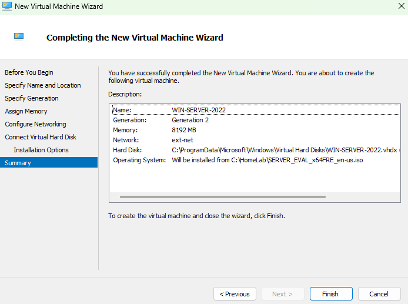
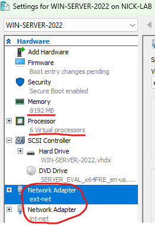
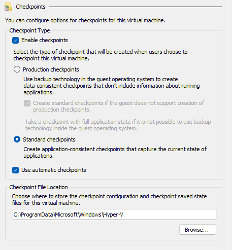

## Step 3: Creating the Windows Server 2022 VM

## Goal
To create the VM shell that will eventually become the lab's primary domain controller. I will be allocating hardware resources, attaching both virtual switches, and configuring the Hyper-V settings needed before installing the OS. 

## Environment
- Host: Hyper-V (see [01-hyperv-setup](../01-hyperv-setup/README.md))
- Switches: `int-net` (internal) and `ext-net` (external) (see [02-virtual-switches](../02-virtual-switches/README.md))
- ISO: Windows Server 2022 Evaluation, downloaded from the Microsoft Evaluation Center

## Steps

### VM creation wizard
1. Opened Hyper-V Manager --> New --> Virtual Machine
2. Name: `WIN-SERVER-2022`
3. Generation: **Generation 2**
4. Memory: **8192 MB**, with Dynamic Memory enabled
5. Networking: connected to `ext-net` for the initial wizard (second adapter for `int-net` gets added after, below)
6. Virtual Hard Disk: new disk, **130 GB** (in case I add SCCM/MECM later)
7. Installation: pointed to the Windows Server 2022 ISO

### Post-creation settings
8. Right clicked on the new VM --> Settings:
   - **Add Hardware --> Network Adapter**, connected to `int-net`
     - This gives the domain controller connectivity to the external network (`ext-net`) for internet access. And the internal lab network (`int-net`) for domain services and client communication
   - On the `ext-net` adapter, I enabled bandwidth management and capped it at 50 Mbps
     - This limits the max network throughput of the VM, which prevents it from consuming excessive bandwidth and simulating resource controls that may be used in enterprise virtualization environments
   - Processors: set from 3 to 4
     - Allocated 4 virtual processors for Windows Server and Active Directory services while reserving resources for the host and additional VMs
   - Checkpoints: confirmed **Standard checkpoints** were enabled
     - This creates recoverable snapshots of the VM, so the environment can be restored if necessary after major config changes
9. Opened Hyper-V settings and confirmed **Enhanced Session Mode** is checked at the host level

## Why two network adapters?
The point of having two network adapters is because the domain controller (DC) needs `ext-net` to reach the internet for updates, activation, DNS forwarding, etc. And it needs `int-net` to serve the rest of the lab for DHCP, DNS, and Active Directory on an isolated internal segment. Later on, the DC's `ext-net` connection is what will let the whole internal network reach the internet.

## Issues Encountered
Nothing of note to add here. Everything went smoothly creating the VM. 

## Result
The VM `WIN-SERVER-2022` exists with two network adapters (ext-net and int-net), 8 GB dynamic memory, a 130 GB disk, 4 virtual processors, enabled checkpoints, and Enhanced Session Mode available. Ready to install the OS. (see [04-server2022-os-install](../04-server2022-os-install/README.md)).

 

**New VM creation wizard:**

**VM Settings showing network adapters, memory, and processors:**

**Checkpoint settings:**

