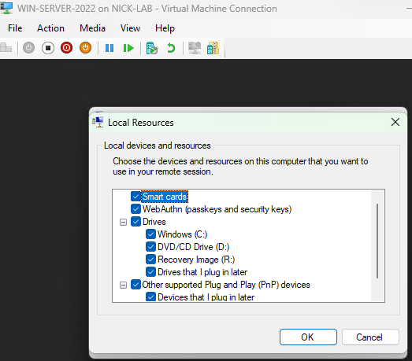
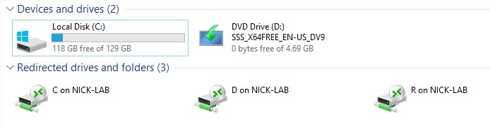
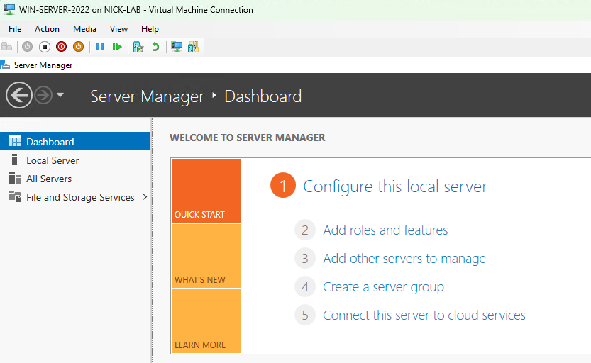

# Step 4: Installing Windows Server 2022 OS

## Goal
Install Windows Server 2022 (Desktop Experience) onto the VM that was created in the previous step, and configure Enhanced Session Mode for a usable console experience (resolution, clipboard, drive redirection).

## Environment
- VM: `WIN-SERVER-2022`, Generation 2, dual-homed (ext-net + int-net) (see [03-server2022-vm-creation](../03-server2022-vm-creation/README.md))
- ISO: Windows Server 2022 Evaluation

## Steps

### OS Installation
1. Started the VM through the Hyper-V Manager and pressed a key to boot from the ISO when prompted
2. Selected **Windows Server 2022 Standard Evaluation (Desktop Experience)** to simplify learning and administration using the GUI
3. Chose **Custom install**, selected the unallocated 130 GB virtual disk, and let it install
4. After the installation and the reboot, I set the local Administrator password

### Enhanced Session Mode setup
5. When logging in, a popup appeared for Enhanced Session config:
   - Set display size to 1366x768
   - Checked "Additional options" --> saved these settings for future connections
6. Clicked on the Local Resources tab --> checked **Clipboard** (for copy and pasting commands and files between the host and the VM)
7. Under more options, I linked the local host drives so I can transfer files like ISOs and scripts into the VM
8. Clicked Connect, logged in with the Administrator password to confirm everything works.

## Issues Encountered
I didn't encounter any real issues while installing the server OS. During the Enhanced Session Mode setup, I did forget to click to save the settings for future connections, so I just closed out of the window for the VM and opened it up again and I was able to click to save the settings. 

## Result
Windows Server 2022 is installed on `WIN-SERVER-2022`, the Administrator account is all set, and Enhanced Session Mode is working with the clipboard and drive redirection enabled. Ready for static IP assignment and rename (see [05-static-ip-and-rename](../05-static-ip-and-rename/README.md)).

 

**Enhanced Session Mode Local Resources tab:**
 

**List of drives on VM (130 GB virtual disk and redirected drives on host (NICK-LAB)):**
 

**Server Manager Dashboard on the VM:**
 

