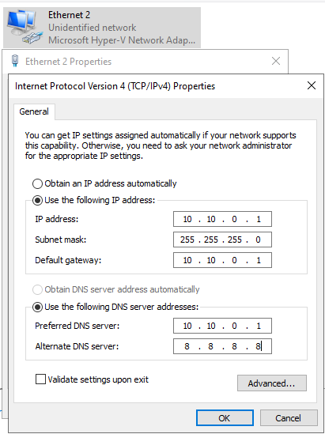
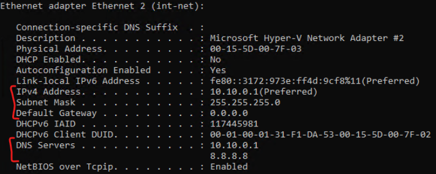
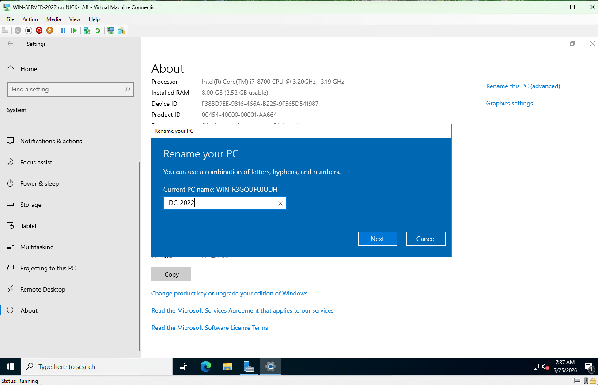

# Step 5: Static IP Assignment and Server Rename

## Goal
To give the server a fixed identity on the internal network before promoting it to a DC (domain controller). A DC should use a static IP address and DNS configuration so that clients can always locate the domain services.

## Environment
- VM: `WIN-SERVER-2022`, Windows Server 2022 Desktop Experience installed (see [04-server2022-os-install](../04-server2022-os-install/README.md))
- Network adapters: one on `ext-net` and one on `int-net`

## Steps

### Identify the correct adapter
1. On the VM, opened **Network and Internet Settings --> Change adapter options**
2. Two adapters were listed (Ethernet and Ethernet 2), so I needed to figure out which one was `ext-net` and which one was `int-net`
   - On the host, I did:
       ```powershell
       Get-VMNetworkAdapter -VMName "WIN-SERVER-2022" | Select SwitchName, MacAddress
       ```
     to receive output:
     <br>
     `SwitchName   MacAddress`
     <br>
     `ext-net      00155D007F02`
     <br>
     `int-net      00155D007F03`
     <br>
     <br>
   - To match MAC addresses on the VM, I did:
       ```powershell
       Get-NetAdapter | Select Name, InterfaceDescription, Status, MacAddress
       ```
       to receive the output that `Ethernet 2` had the same MAC address as `int-net` and `Ethernet` had the same one as `ext-net`.

### Assign static IP
3. Right clicked on `Ethernet 2` --> Properties --> **Internet Protocol Version 4 (TCP/IPv4)** --> Properties
4. Set:
   - **IP address:** `10.10.0.1` (.1 at the end for the DC being the main device, usually giving it the first usable address)
   - **Subnet mask:** `255.255.255.0` (/24 - standard default for small networks)
   - **Default gateway:** `10.10.0.1` (this is really the default gateway for other devices, so they can route to the DC, and the DC communicates outside with `ext-net`)
   - **Preferred DNS:** `10.10.0.1` (points to itself because it will become the DNS server)
   - **Alternate DNS:** `8.8.8.8` (Google's public DNS, used as a fallback for anything the DC's DNS doesn't know)
5. Renamed `Ethernet` to `Ethernet (ext-net)` and `Ethernet 2` to `Ethernet 2 (int-net)`

### Rename the computer
6. Went to Windows settings --> System --> About --> Rename this PC --> Renamed to DC-2022
7. Restarted to apply

### Verified
8. After reboot, confirmed through:
    ```powershell
    ipconfig /all
    ```
      The int-net adapter shows the static `10.10.0.1` and the hostname is `DC-2022`.

## Issues encountered
When setting the Default Gateway to 10.10.0.1, which is the same as the adapter's own static IP, and saving it, it would always revert to 0.0.0.0. This was confirmed through repeated `ipconfig /all` checks.

After some research, I realized that Windows won't keep a default gateway equal to the interface's own address, since routing traffic to yourself to reach outside networks doesn't make sense. The adapter is also directly connected to the 10.10.0.0/24 network, so it doesn't need a gateway to reach anything on that subnet. The DC's actual route to the internet is through its ext-net adapter. The 10.0.0.1 gateway matters for other devices on int-net, which will use the DC as their gateway once DHCP and everything else is configured. 

**Fix:** left the gateway field blank on the int-net adapter. Static IP, subnet, and DNS remain configured. 

## Result
`DC-2022` has a static IP of `10.10.0.1` on `int-net`, DNS pointed at itself, and a proper hostname. Now it can be promoted to a domain controller (see [06-active-directory-promotion](../06-active-directory-promotion/README.md)).

<br>

**IPv4 properties with static IP:**
<br>


**ipconfig /all output for int-net:**
<br>


**Rename PC dialog:**
<br>

