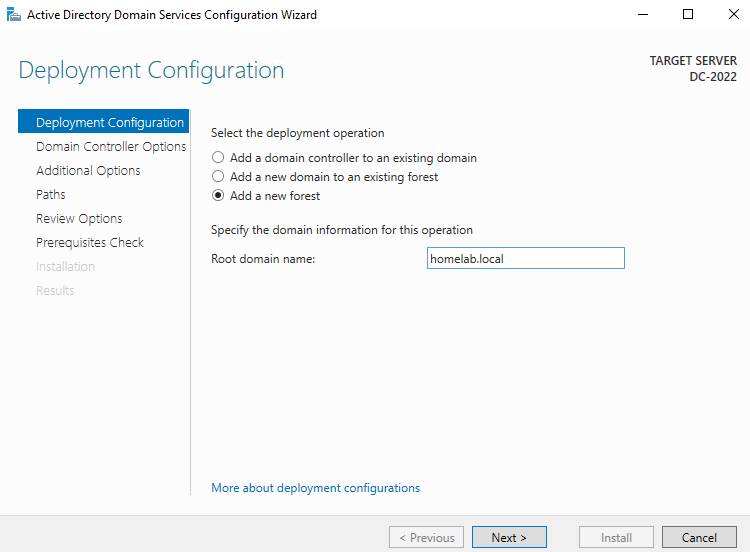
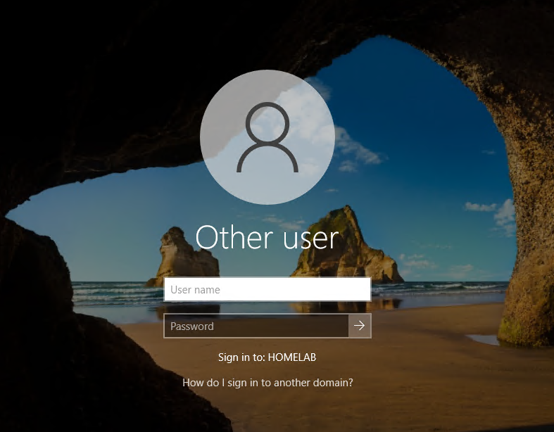
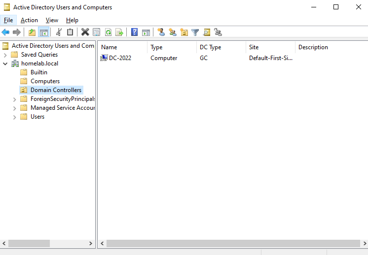
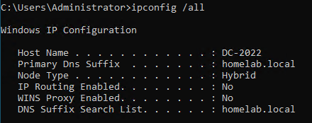

# Step 6: Installing AD DS and Promoting to a Domain Controller

## Goal
Install the Active Directory Domain Services role and promote `DC-2022` to the first domain controller in a new AD forest, creating the domain that every other lab device will join.

## Environment
- VM: `DC-2022` (formerly `WIN-SERVER-2022`), static IP 10.10.0.1 on `int-net` (see [05-static-ip-and-rename](../05-static-ip-and-rename/README.md))

## Steps

### Install the AD DS role
1. On Server Manager --> Manage --> **Add Roles and Features**
2. For installation type, chose **Role-based or feature-based installation** for AD DS
3. Selected `DC-2022` server to install roles and features on
4. Left everything else as default because no additional Windows features were required for a standard AD DS deployment
5. Waited for the install to complete and closed the wizard

### Promote to domain controller
6. Clicked the notification flag in Server Manager --> **Promote this server to a domain controller**
7. In the AD DS Configuration wizard:
   - Deployment configuration: **Add a new forest**
   - Root domain name: `homelab.local`
8. Set a **DSRM (Directory Services Restore Mode) password**
   - This is a separate offline recovery password and is not the domain admin password
9. Continued through defaults for DNS delegation
   - Skipped because the lab is creating a new AD forest with its own DNS, not integrating into an existing DNS
11. Confirmed the NetBIOS name auto filled correctly as `HOMELAB`
12. Reviewed the paths and left them as default
13. Prerequisites check ran and reviewed the warnings (see Issues Encountered below)
14. Clicked **Install**. Server configured itself and rebooted automatically

### Post-reboot verification
14. Logged back in and noticed it is now logging into the `HOMELAB` domain
15. Opened **Active Directory Users and Computers** (Tools menu in Server Manager) to confirm the domain structure exists
16. Ran `ipconfig /all` to confirm DNS is resolving `homelab.local`

## Understanding DSRM
After doing some research, I found out that DSRM is a special safe mode boot option for a domain controller, used when the AD becomes corrupted and needs offline repair. This recovery account is separate from the normal domain administration account. It will rarely be used, but it needs to be set now and remembered in case a DC ever fails to boot normally later on.

## Issues Encountered
The prerequisites check showed a warning about the DC's DNS server (itself) not yet being configured before promotion. This is completely expected since DNS gets installed as part of this same wizard.

I had to look up exactly what DSRM actually was because I wasn't sure and the wizard doesn't explain it fully.

## Result
`DC-2022` is the first domain controller for the `homelab.local` forest. AD DS and DNS are running, and I can log in with the domain qualified Administrator account. Ready to create a proper domain admin account (see
[07-domain-admin-account](../07-domain-admin-account/README.md)).

 

**AD DS Configuration Wizard showing deployment and new forest:**
 

**Login screen for HOMELAB domain:**
 

**Active Directory Users and Computers:**
 

**ipconfig /all output confirming DNS resolves the domain:**
 

