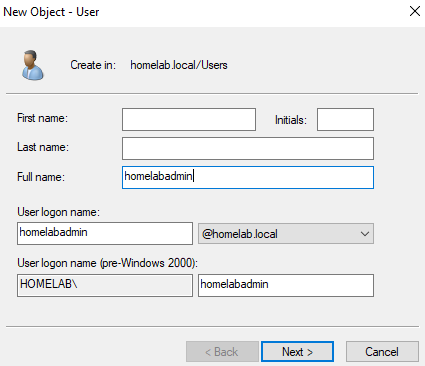
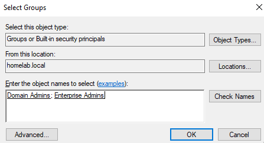
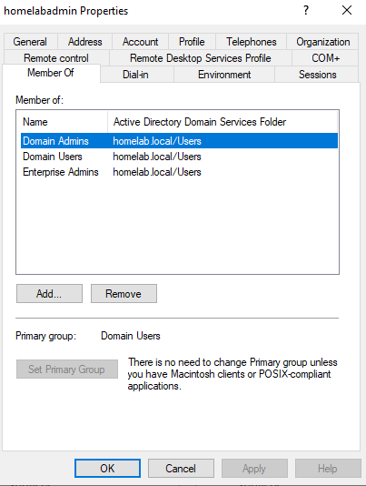

# Step 7: Creating a Domain Administrator Account

## Goal
To create a named domain admin account for everyday administration, rather than relying on the built in Administrator account long term. This is standard practice to rename or disable the built in account. Admin actions should be traceable to a specific named account, which will be created during this step. 

## Environment
- VM: `DC-2022`, domain `homelab.local` established (see [06-active-directory-promotion](../06-active-directory-promotion/README.md))
- Logged in as: `HOMELAB\Administrator` (the built in domain administrator that was created automatically during promotion)

## Steps

### Create the user
1. Server Manager --> **Tools --> Active Directory Users and Computers**
2. Expanded the domain, right clicked **Users** --> **New --> User**
3. Entered:
   - Full name: homelabadmin
   - User logon name: `homelabadmin`
4. Set a password, unchecked "User must change password at next logon," checked **Password never expires**
   - This is purely for lab purposes, and might not be standard practice

### Grant admin rights
5. Right clicked the new `homelabadmin` user --> **Add to a group...**
6. Added to:
   - **Domain Admins**: full control over the domain
   - **Enterprise Admins**: full control across the entire forest (only matters when there's more than one domain, which may be added in the future)
7. Confirmed group membership right clicking the user --> Properties --> **Member Of** tab

### Verify
8. Rebooted and logged out
9. Logged back in as `HOMELAB\homelabadmin` using the new password at the login screen
10. Confirmed that I could still open Active Directory Users and Computers without permission errors, proving that the group membership took effect

## Understanding why to create a new domain administrator account
Instead of using the built in admin account, it is standard practice to create a new one. After doing a little research, I found out this is because the built in account is a well known target since its SID is predictable and it's the first account attackers and tools try. Using a named account for daily admin work, and eventually renaming or disabling the built in one is standard hardening practice. 

## Issues Encountered
No issues to report here.

## Result
`HOMELAB\homelabadmin` exists as a domain admin account with Domain Admins and Enterprise Admins membership, verified by logging in and successully accessing AD tools. Ready to install DHCP (see [08-dhcp-setup](../08-dhcp-setup/README.md)).

 

**New User creation wizard with logon name:**
 

**Add to Group dialog with groups added:**
 

**Member Of tab confirming group membership:**
 

