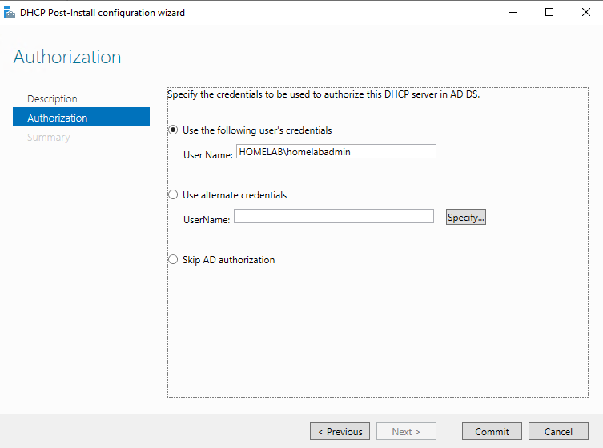
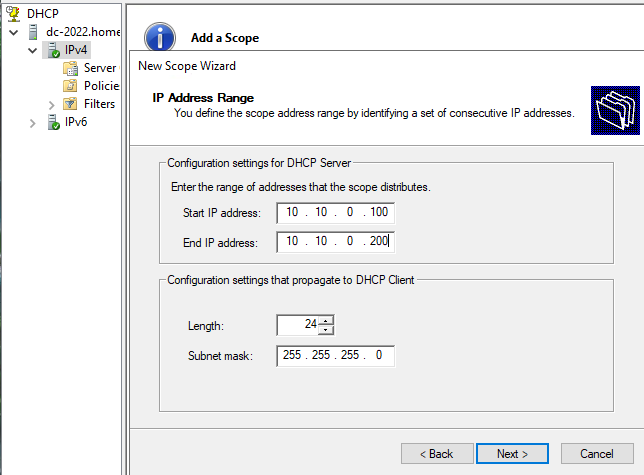
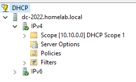

# Step 8: Installing and Configuring DHCP

## Goal
Install the DHCP Server role on DC-2022 so lab devices such as workstations and a second DC can get IP addresses automatically instead of needing static IPs configured by hand on every machine.

## Environment
- VM: `DC-2022`, domain `homelab.local`, static IP 10.10.0.1 on int-net (see [07-domain-admin-account](../07-domain-admin-account/README.md))
- Logged in as: `HOMELAB\homelabadmin`

## Steps

### Install the role
1. Server Manager --> **Manage --> Add Roles and Features**
2. Selected **DHCP Server** and accepted the prompt for required management tools
3. Left everything else as default, since I'm installing just a standard DHCP server, and installed
4. After the install, clicked the notification flag on Server Manager --> **Complete DHCP configuration**
5. Ran through the post install wizard, for authorization I specified `homelabadmin` credentials
6. Confirmed success messages after authorization completed

## Create the scope
7. **Tools --> DHCP**, expanded `dc-2022.homelab.local`, right clicked **IPv4 --> New Scope...**
8. Scope name: `DHCP Scope 1` (this doesn't affect function at all)
9. IP address range:
   - Start: `10.10.0.100`
   - End: `10.10.0.200`
   - Left room for more static assignments later, such as the second DC
10. No exclusions were needed, since the whole range is already outside my static assignments (.1 through .99 reserved by not being in this range)
11. Set lease duration to 180 days since the lab only has a small number of long lived VMs that rarely change, making frequent DHCP renewals unnecessary
    - In a real company, devices like laptops may have only a few days long lease since they come and go often
12. Configured DHCP options to take effect now instead of later
13. Router (default gateway) option: entered `10.10.0.1` (the DC) and clicked Add
14. DNS server option was auto filled with parent domain `homelab.local` and IP address `10.10.0.1`
15. Finished the wizard and activated the scope
16. Verified the scope is there in the left sidebar

## Why the address range is split this way
I split the address range so `.1` - `.99` is implicitly reserved for static assignments like the DC and any future assignments. For `.100` - `.200`, they are handed out dynamically to whatever joins the network like workstations and anything that doesn't need a fixed address. The last set of addresses `.201` - `.254` is left for future static devices without needing to shrink the DHCP range later on.

## Issues Encountered
Encountered no issues during this step. 

## Result
DHCP is installed and authorized on `DC-2022`, with an active scope (10.10.0.100 - 10.10.0.200) that automatically assigns clients an IP address, designates the DC as the DNS server, and configures it as the default gateway. Ready to configure RRAS/NAT so the internal network actually reaches the internet (see [09-rras-nat-routing](../09-rras-nat-routing/README.md)).

 

**DHCP Post-Install Authorization:**
 

**New Scope wizard - IP address range screen:**
 

**DHCP console showing new active scope:**
 

