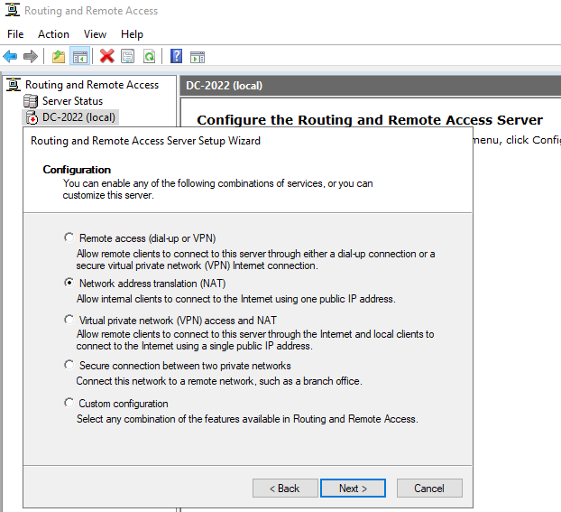
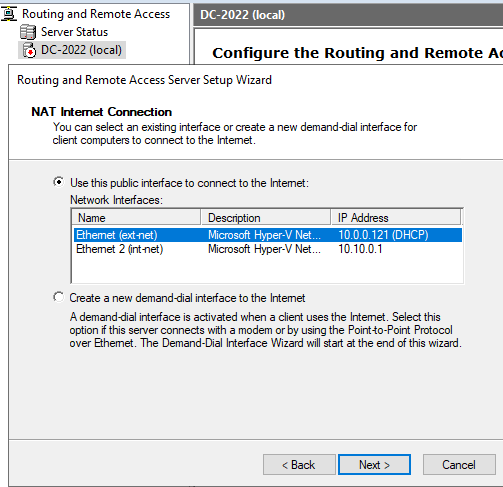
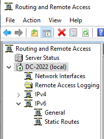
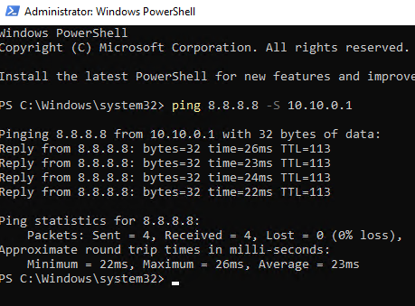

# Step 9: Setting Up Internet Routing with RRAS (NAT)

## Goal 
Configure `DC-2022` to act as a router/NAT gateway between the internal lab network (int-net) and the outside internet (ext-net), so DHCP-assigned lab devices can actually reach the internet through the DC.

## Environment
- VM: `DC-2022`, DHCP active with scope 10.10.0.100 - 10.10.0.200 (see [08-dhcp-setup](../08-dhcp-setup/README.md))
- Adapters: `int-net` (10.10.0.1, internal) and `ext-net` (DHCP-assigned from home router, internet-facing)

## Steps

### Install the Remote Access role
1. Server Manager --> **Manage --> Add Roles and Features**
2. Selected **Remote Access**, left role services default at this stage since additional routing and NAT functionality will be configured after installation using the console
3. After install, went into role services and selected **Routing** which automatically pulled in **DirectAccess and VPN (RAS)** as a dependency
   - Also when choosing Routing, it automatically added features that are required for RAS
4. Confirmed defaults for the rest and completed installation

### Enable and configure routing
5. Went to **Tools --> Routing and Remote Access**
6. Right clicked the server (DC-2022) which is shown with a red down arrow, meaning it's not configured yet) --> **Configure and Enable Routing and Remote Access**
7. Selected **Network address translation (NAT)** as the configuration type
8. Selected the `ext-net` adapter as the public and internet-facing interface
   - Its IP didn't match my static `int-net` assignment, which is expected
9. Finished the wizard and confirmed the server now shows a green up arrow in Routing and Remote Access
   - Additional interfaces also appeared under IPv4 (Loopback, the two NICs, NAT)

## Verifying it works
First attempt, run from DC-2022 with no target/source specified:

```powershell
Test-NetConnection
```

This defaulted to Microsoft's built-in connectivity target (`internetbeacon.msedge.net`) and succeeded. But the problem was it showed the source as `10.0.0.121` (my home network's DHCP-assigned address for the ext-net adapter). This command only proved that DC-2022 can reach the internet directly through ext-net. It did not prove that NAT was translating traffic from the int-net side, since that traffic didn't need translation in the first place. 

<br>

In order to prove that NAT is actually working, the test needs to originate from the **int-net** address (10.10.0.1) and still succeed, meaning that traffic had to be translated through the ext-net adapter to get out and back. I tried:

```powershell
Test-NetConnection 8.8.8.8 -SourceAddress 10.10.0.1
```

This failed since `-SourceAddress` isn't a valid parameter for `Test-NetConnection` on older PowerShell versions (`ParameterBindingException`). So I just went and used `ping`, which supports forcing a source address with `-S`:

```powershell
ping 8.8.8.8 -S 10.10.0.1
```

<br>

**Result:** `Pinging 8.8.8.8 from 10.10.0.1 with 32 bytes of data`, 4/4 replies received, 0% packet loss, RTT averaging 23ms. This confirms traffic sourced from the int-net side address successfully routed out through ext-net, got NAT'd, reached 8.8.8.8, and returned which proves that NAT is actually functioning and not just that the RRAS service shows "running."

## Why NAT specifically and not just routing
Routing only forwards traffic between different networks, while NAT translates private IP addresses to a routable address so that devices on the internal network can communicate with the internet. In this scenario, NAT lets every device on `10.10.0.0/24` share the DC's `ext-net` public facing IP for outbound internet traffic. It translates internal private addresses to that one external address and back. Without NAT, my home router would have no idea how to route traffic back to internal 10.10.0.x addresses since they're not real publicly routable addresses. 

## Issues Encountered
While I was in the NAT wizard, the network interfaces box was empty. To fix this, I closed out of the wizard and reopened it. Both the ext-net and int-net adapters showed up after that.

<br>

There was trouble verifying that setting up NAT worked or not, which is explained above. 

## Result
DC-2022 is routing NAT'd traffic between int-net and ext-net, confirmed with a green up arrow in RRAS, and also a successful `ping 8.8.8.8 -S 10.10.0.1` proving traffic sourced from the internal network is being translated and reaching the internet. The internal lab network has full internet access through the DC. This completes the core DC build, next is adding client workstations (see [10-win10-workstation](../10-win10-workstation/README.md)).

<br>

**RRAS configuration type with NAT selected:**
<br>


**Public interface selection showing ext-net chosen:**
<br>


**RRAS console showing green up arrow, server running:**
<br>


**ping -S 10.10.0.1 output confirming NAT translation works:**
<br>

