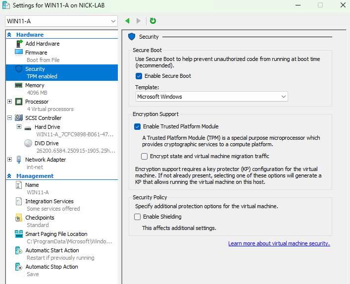
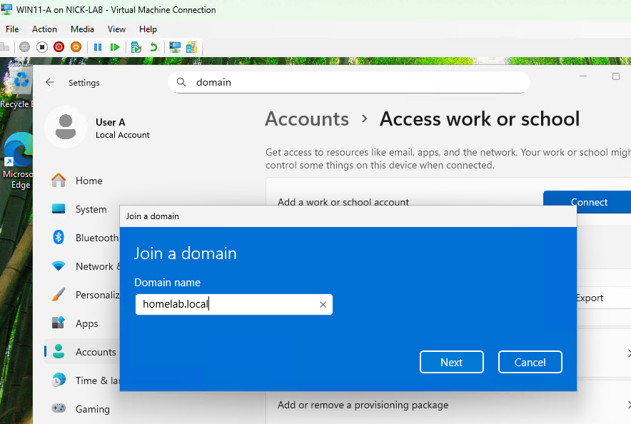
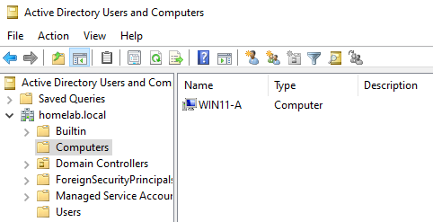

# Step 10: Adding a Windows 11 Workstation (TPM Compliant Path)

## Goal
Build the first client workstation and join it to the homelab.local domain, using a properly TPM enabled VM to represent a standard, hardware compliant Windows 11 install and domain join via the normal GUI method.

## I was originally going to do Windows 10 but...
At the beginning I was originally going to do a Windows 10 workstation, but when I went to download the Windows 10 Enterprise evaluation ISO, I found out that Microsoft got rid of it, since mainstream support for Windows 10 ended in October 2025. I thought it would be perfectly fine to do Windows 10 in a home lab environment, but the download for the ISO is nowhere to be found. Instead I'm doing two Windows 11 workstations that will be differentiated by configuration. 

## Environment
- DC: `DC-2022`, DHCP/DNS/NAT all confirmed working (see [09-rras-nat-routing](../09-rras-nat-routing/README.md))
- ISO: Windows 11 Enterprise Evaluation (90 day), from Microsoft's evaluation center

## Steps

### Create the VM
1. Hyper-V Manager --> New --> Virtual Machine
2. Name `WIN11-A`
3. Generation: **Generation 2**
4. Memory: **4096 MB**, Dynamic Memory enabled
5. Networking: connected to **int-net**
6. Virtual hard disk: new disk, 45 GB

### Enable virtual TPM (the main difference for this VM)
7. Before installing, went into VM **Settings --> Security**:
   - Checked **Enable Trusted Platform Module**
   - Confirmed **Enable Secure Boot** is checked (default template: Microsoft Windows)
8. Assigned 4 virtual processors under Processors

### Install the OS
9. Started the VM, booted from the Windows 11 ISO
10. Language/region defaults --> **Install now**
11. Accepted license terms
12. Selected the unallocated 45 GB disk
13. At setup type: **Set up for work or school** --> **Domain join instead** (skips Microsoft account requirement)
14. Created a temporary local account for initial setup

### Rename and join the domain (GUI method)
15. Logged in with the temporary local account
16. Right clicked Start --> **System --> Rename this PC**
17. Computer name: `WIN11-A`
18. Under Accounts --> Access work or school --> Add a work or school account --> Connect --> Join this device to a local Active Directory domain
19. Entered the domain `homelab.local`
20. Entered homelabadmin credentials when prompted
21. Skipped the "Add an account" prompt
    - homelabadmin already has Domain Admin privileges, so additional local admin rights would have been useless
    - Also, domain users receive standard user permissions by default, following the principle of least privilege
22. Restarted

### Verification 
23. Logged in at "Other user" as `homelab\homelabadmin` to confirm the join
24. Checked Active Directory Users and Computers (ADUC) on DC-2022 to confirm that `WIN11-A` appears under Computers

## Issues Encountered
When I first opened up the new VM, it wasn't registering any of my keyboard and mouse inputs. This was fixed when simply closing and reopening it.

## Result
`WIN11-A` is a domain joined Windows 11 workstation built with a fully TPM and Secure Boot compliant configuration, joined via the regular GUI method. This also represents a typical compliant hardware onboarding scenario. Now I will be adding a second Windows 11 workstation using the bypass method and PowerShell domain join, to do something different than this one ((see [11-win11-workstation-2](../11-win11-workstation-2/README.md)).

 

**VM Security settings showing vTPM and Secure Boot enabled:**
 

**Domain join dialog with homelab.local entered:**
 

**WIN11-A appearing in ADUC Computers:**
 

