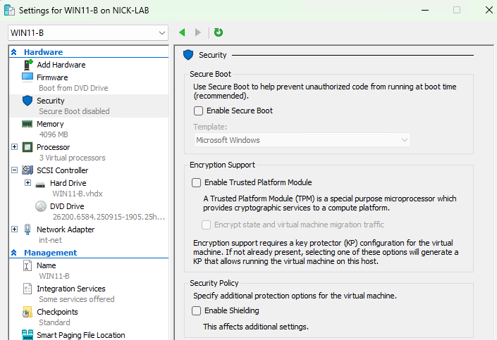
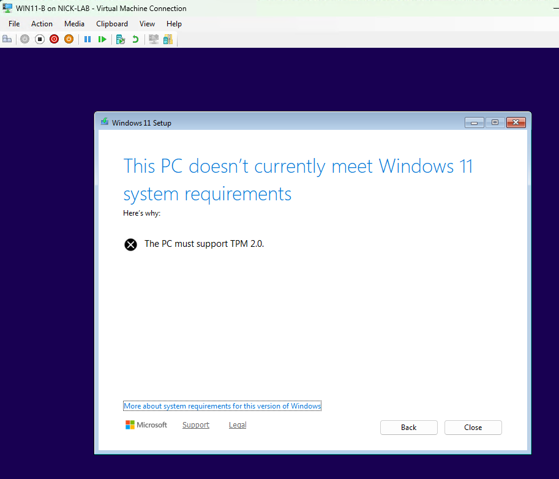
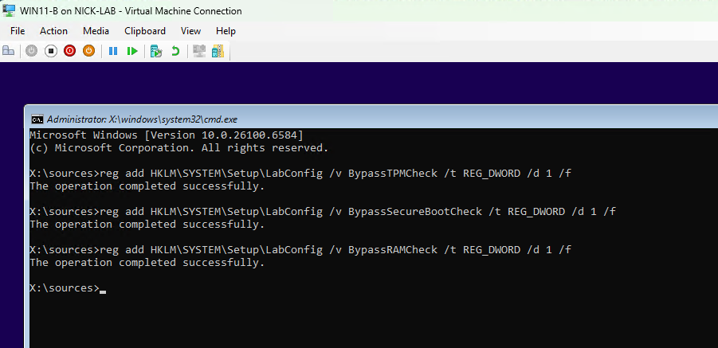
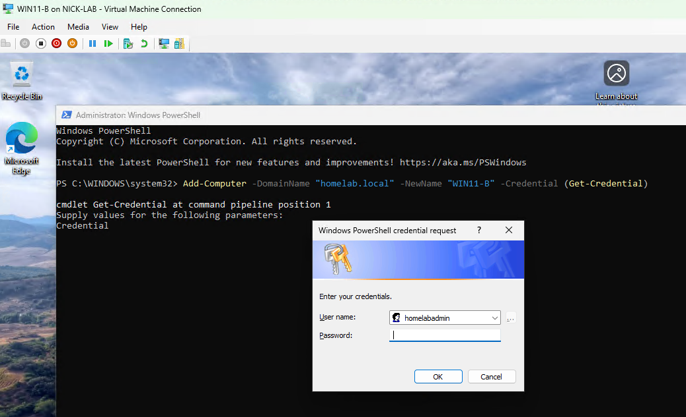
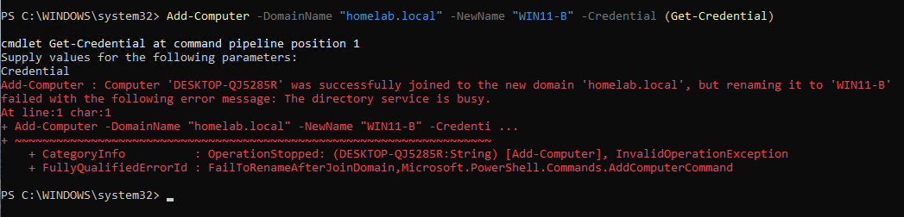
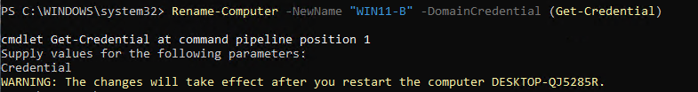
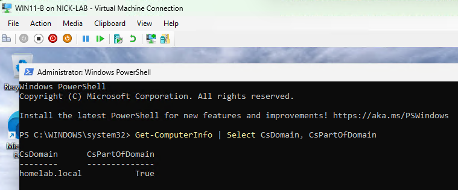

## Step 11: Adding a Second Windows 11 Workstation (Bypass Path)

## Goal
To build a second client workstation *without* TPM/Secure Boot enabled, using the registry bypass that Microsoft provides for unsupported hardware. This represents a real scenario where older machines need Windows 11. The domain will be joined via PowerShell instead of the GUI, as a more scriptable and admin style alternative to Step 10's method. 

## Environment
- DC: `DC-2022`, DHCP/DNS/NAT confirmed working
- WIN11-A: first workstation, domain joined with GUI, TPM compliant (see [10-win11-workstation-1](../10-win11-workstation-1/README.md))
- ISO: same Windows 11 Enterprise Evaluation ISO used for WIN11-A

## Steps

### Create the VM (specifically non-compliant)
1. Hyper-V Manager --> New --> Virtual Machine
2. Name: `WIN11-B`
3. Generation: **Generation 2**
4. Memory: **4096 MB**, Dynamic Memory enabled
5. Networking: connected to **int-net**
6. Virtual hard disk: new disk, 45 GB
7. VM Settings --> Security: **left TPM and Secure Boot unchecked**
   - This is intentional in order to trigger the "This PC can't run Windows 11" block during setup

### Hit the compatibility block, then bypass it
8. Started the VM, booted from ISO, proceeded through language/region selection
9. After selecting Setup options, hit the expected **"This PC can't run Windows 11"** screen
10. Used **Shift + F10** to open a command prompt from within setup
11. Ran the registry bypass. After doing some research, I learned `LabConfig` is a registry key (`HKLM\SYSTEM\Setup\LabConfig`) that Windows Setup checks during installation. It doesn't exist by default and isn't officially documented as a supported install method, but Setup's own code recognizes these specific value names and skips the hardware checks when they're set to 1:
    ```cmd
    reg add HKLM\SYSTEM\Setup\LabConfig /v BypassTPMCheck /t REG_DWORD /d 1 /f
    reg add HKLM\SYSTEM\Setup\LabConfig /v BypassSecureBootCheck /t REG_DWORD /d 1 /f
    reg add HKLM\SYSTEM\Setup\LabConfig /v BypassRAMCheck /t REG_DWORD /d 1 /f
    ```

    - `BypassTPMCheck` skips the TPM 2.0 presence check
    - `BypassSecureBootCheck` skips the UEFI Secure Boot check
    - `BypassRAMCheck` skips the minimum RAM check (included for completeness but unneeded for this specific VM)

    Each `reg add` targets the same key but a different value name. `/t REG_DWORD /d 1` sets each flag to enabled as a 32-bit integer and `/f` forces the write without a confirmation prompt
12. Closed the command prompt, clicked **Back**, then proceeded forward through setup and the compatibility check passed this time
13. Continued through and selected the 45 GB disk that was made
14. **Set up for Work or School** --> **Sign-in options** --> **Domain join instead** --> temporary local account for initial setup

### Join the domain via PowerShell (not GUI this time)
15. Logged in with the temporary local account
16. Opened PowerShell as Administrator
17. Attempted to rename and join in a single command:
    ```powershell
    Add-Computer -DomainName "homelab.local" -NewName "WIN11-B" -Credential (GetCredential)
    ```

    - `Add-Computer` is PowerShell's equivalent of the GUI's rename and domain join dialogs combined
    - `-DomainName` / `-NewName` targets the domain and new computer name
    - `-Credential (GetCredential)` pops up a secure prompt for entering domain admin username and password
18. The join succeeded, but the rename portion failed with "The directory service is busy."
    - The computer joined the domain successfully under its default name (`DESKTOP-QJ5285R`), but couldn't rename in the same operation. See Issues Encountered below.
19. Ran the rename as a separate follow up command instead:
    ```powershell
    Rename-Computer -NewName "WIN11-B" -DomainCredential (Get-Credential)
    ```

    - `Rename-Computer` changes the machine's computer name
    - `-NewName "WIN11-B"` is the name I'm changing it to
    - `-DomainCredential (Get-Credential)` (instead of `-Credential`) is used since renaming a domain joined computer requires updating the computer object on the DC itself, not just a local setting. This parameter                    authenticates to AD with the supplied credentials to make the change.
20. VM restarted, computer name updated correctly on the next boot

### Verify 
21. Logged in at "Other user" as `HOMELAB\homelabadmin`
22. Confirmed via PowerShell that the domain join worked, beyond just the login succeeding:
    ```powershell
    Get-ComputerInfo | Select CsDomain, CsPartOfDomain
    ```

    - `Get-ComputerInfo` returns a large object full of system info. Running it alone would give way more information than needed
    - `|` is the pipe. It takes the output of the command on the left and feeds it as input to the command on the right
    - `Select CsDomain, CsPartOfDomain` shows which domain the computer thinks it belongs to and a True/False flag confirming whether the machine is actually domain joined
23. Checked ADUC on DC-2022 and confirmed `WIN11-B` now appears in Computers alongside `WIN11-A`

## Why this configuration matters
Real IT environments may have to support older hardware that doesn't meet Windows 11's official TPM and Secure Boot requirements, and Microsoft provides this registry bypass for this exact scenario. It's not supported at all and comes with its own issues, such as Microsoft refusing updates on bypassed machines. But I think that understanding this and knowing that it's an actual Microsoft provided escape hatch and not a hack found online is relevant to any kind of sysadmin job dealing with a mixed age device roster during a Windows 11 migration.

## Issues Encountered
`Add-Computer` with both `-NewName` and the domain join in a single command partially failed. The computer successfully joined homelab.local as its default name (DESKTOP-QJ5285R), but the rename to WIN11-B failed with "The directory service is busy" (FailToRenameAfterJoinDomain).

This seems to be an AD timing issue. The join and rename are two separate operations and the DC wasn't ready to process the second request (the rename) immediately after the first. The join itself was unaffected.

**Fix:** ran the rename as a separate follow up command once the directory service was no longer mid operation:

```powershell
Rename-Computer -NewName "WIN11-B" -DomainCredential (Get-Credential)
```

**Lesson:** bundling multiple AD-writing operations in a single command doesn't guarantee that they'll both succeed. It's worth verifying each part completed rather than assuming success from a single command running without an error.

## Result
`WIN11-B` is a domain joined Windows 11 workstation built without TPM/Secure Boot, using Microsoft's official LabConfig bypass, and joined to homelab.local entirely through PowerShell rather than the GUI. Combined with WIN11-A, I now have two workstations built through two different paths, compliant/GUI and bypass/PowerShell, which covers common real world scenarios. In the next step, I will be expanding beyond default AD structure with custom OUs and security groups (see [12-organizational-units](../12-organizational-units/README.md)).

<br>

**VM Security settings with TPM/Secure Boot unchecked:**
<br>


**"This PC can't run Windows 11" compatibility block:**
<br>


**LabConfig registry commands in Shift+F10 command prompt:**
<br>


**Add-Computer PowerShell command with Credential popup and partial success:**
<br>

<br>


**Rename-Computer PowerShell command output:**
<br>


**Get-ComputerInfo output confirming domain membership:**
<br>

