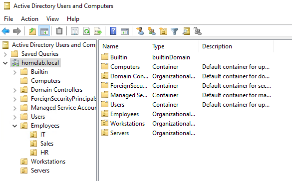
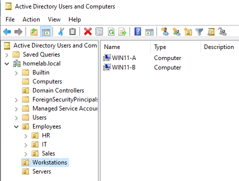
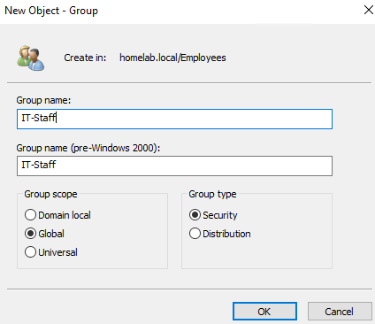
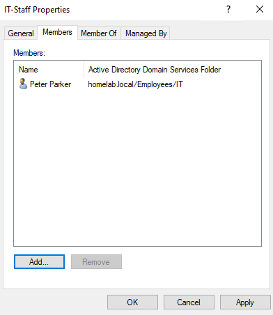

# Step 12: Organizational Units and Security Groups

## Goal
Move beyond AD's default structure (everything sitting in the Users/Computers containers) and build a realistic OU hierarchy with department based security groups. This is the kind of structure that Group Policy, delegation, and file permissions all depend on in a real environment.

## Environment
- DC: `DC-2022`, domain `homelab.local`
- Existing objects: `homelabadmin` (Users container), `WIN11-A` and `WIN11-B` (Computers container) (see [11-win11-workstation-2](../11-win11-workstation-2/README.md))

## Why OUs and not just the default containers
The built in **Users** and **Computers** containers aren't true OUs. Group Policy can't be directly linked to them. I've read that this is the main reason real environments always build a custom OU structure almost immediately. Without doing this, there's no way to apply different policies to different groups of users and machines. OUs also enable delegation, which grants a non-admin limited rights over just one OU, rather than the entire domain.

## Steps

### Design the structure
Sketched out a simple structure reflecting a small organization:
 
|---- OU: Employees
 
| |----- OU: IT
 
| |----- OU: Sales
 
| |----- OU: HR
 
|---- OU: Workstations
 
|---- OU: Servers
 

### Create the OUs
1. Server Manager --> **Tools --> Active Directory Users and Computers**
2. Right clicked homelab.local domain root --> **New --> Organizational Unit**
3. Created `Employees`, checked "Protect container from accidental deletion"
   - This setting blocks deletion of an AD object
4. Right clicked `Employees` --> New --> OU, repeated for `IT`, `Sales`, `HR` as sub-OUs
5. Created `Workstations` and `Servers` as top level OUs, the same as `Employees`

### Move existing objects into the new structure
6. Dragged `WIN11-A` and `WIN11-B` from the default **Computers** container into the new **Workstations** OU
7. Left `DC-2022` where it is (Domain Controllers OU)
   - DCs should never be moved out of their dedicated OU, since that's what makes DC specific GPOs apply correctly

### Create test user accounts
8. Right clicked `Employees > IT` --> New --> User, created a test account (logon name: `pparker`, first/last name: Peter Parker)
9. Set password, unchecked "must change at next logon," left "password never expires" unchecked since it's a regular user account
10. Repeated for one test user in `Sales` and `HR`, to have at least one real object per OU

### Create security groups
11. Right clicked `Employees` --> New --> Group
12. Name: `IT-Staff`
    - Group scope: **Global** (standard for grouping users within a single domain)
    - Group type: **Security** (Security groups can be used for permissions and Distribution groups are email list only)
13. Repeated for `Sales-Staff` and `HR-Staff`
14. Added each test user to their corresponding group by double clicking each group, clicking **Members --> Add**, and typing the logon name

## Why choose Global and Security 
Global scope groups can contain users only from the local domain and can be granted permissions anywhere in the forest. So this is the right choice for a single domain lab. Security type (over Distribution) because only Security groups can actually be referenced in NTFS/share permissions or GPO filtering. Distribution groups exist only for Exchange/email distribution lists and can't be used for access control at all. 

## Issues Encountered
There were no issues during this step.

## Result
`homelab.local` now has a real OU structure (Employees/IT/Sales/HR, Workstations, Servers) instead of the default layout, with department based security groups and test user accounts. This is the structure the next steps (file shares, GPOs) will build on top of. In the next step: file server and department based shared folders (see [13-file-server-shares](../13-file-server-shares/README.md)).

 

**OU structure in ADUC showing Employees/IT/Sales/HR hierarchy:**
 

**WIN11-A and WIN11-B moved into Workstations OU:**
 

**New Group dialog showing Global/Security selections:**
 

**IT-Staff group Members tab showing pparker added:**
 

