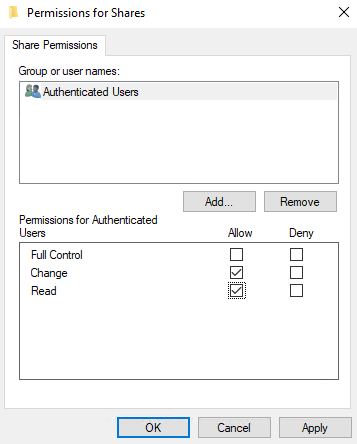
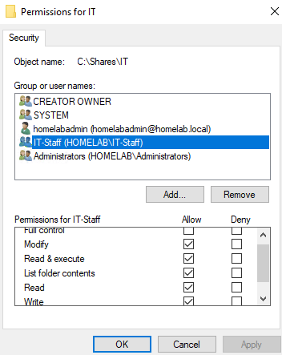
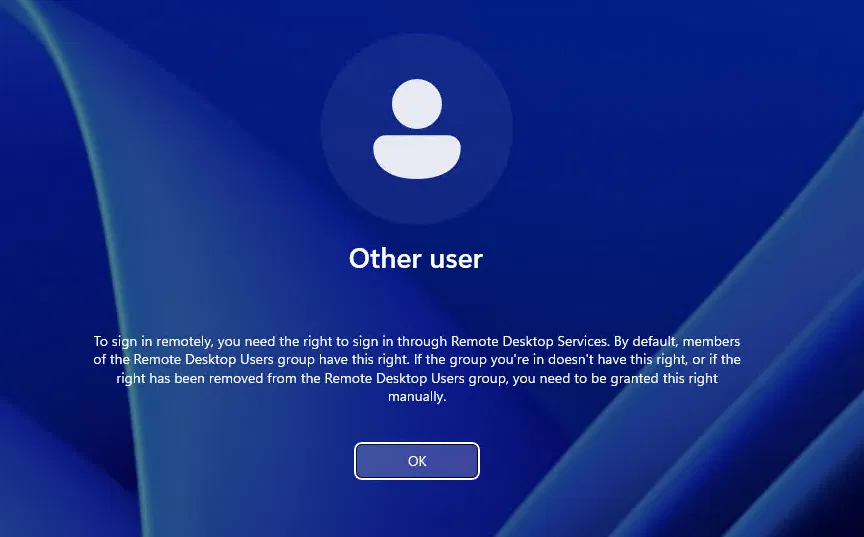
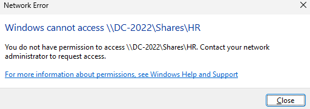
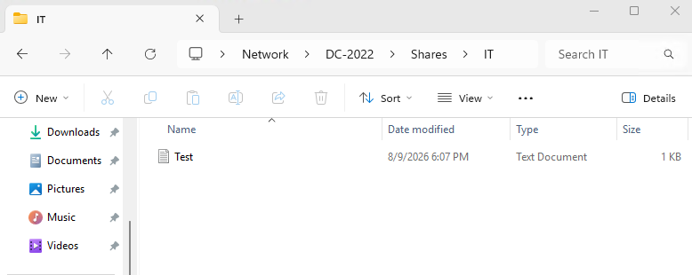

# Step 13: File Server and Department Shared Folders

## Goal
Set up a shared folder structure with department based access control, using NTFS and share permissions together with the security groups built in the previous step. 

## Environment
- DC: `DC-2022`, `homelab.local`, with IT-Staff/Sales-Staff/HR-Staff security groups and matching OUs (see [12-organizational-units](../12-organizational-units/README.md))
- Decided to host shares directly on DC-2022 rather than build a separate file server VM, which is reasonable for small lab. But in a real environment, file services are usually kept off the DC itself

## Steps

### Create the folder structure
1. On DC-2022, created a root folder: `C:\Shares`
2. Inside it, created one folder per department:
   - `C:\Shares\IT`
   - `C:\Shares\Sales`
   - `C:\Shares\HR`
   - `C:\Shares\Common` (Folder that everyone can access)

### Share the folders (Share level permission)
3. Right clicked `C:\Shares` --> **Properties --> Sharing --> Advanced Sharing** --> checked **Share this folder**
4. Share name: `Shares`
5. Clicked **Permissions** --> **Add**, in the text box typed "Authenticated Users" and clicked **Check Names**
   - Windows found and underlined it, confirming it found the valid built-in group
6. With `Authenticated Users` selected, checked the **Allow** box next to **Change**
7. Selected `Everyone` in the same list and clicked **Remove** and **OK**

### Set NTFS permissions per department (real access control)
8. Right clicked `C:\Shares\IT` --> **Properties --> Security --> Advanced --> Disable inheritance**
9. Clicked "Convert inherited permissions into explicit permissions"
   - This makes everything editable/removable instead of grayed out
10. Back on the regular Security tab, clicked **Edit** --> **Users** --> **Remove**
11. Clicked **Add** --> typed `IT-Staff` --> Clicked **Check Names** --> **OK**
12. With `IT-Staff` selected, checked **Modify** under **Allow**, and clicked **Apply**
13. With `homelabadmin` selected, checked **Full Control** under **Allow**, and clicked **OK**
14. Repeated for `Sales` (granting `Sales-Staff`) and `HR` (granting `HR-Staff`, each restricted to only their own department's group)
15. Left `Common` with `Authenticated Users: Modify` (intentionally open to everyone)

### Test access
16. Logged into `WIN11-A` as the `pparker` test account (member of IT-Staff)
17. Accessed `\\DC-2022\Shares\IT` and confirmed read/write access worked
18. Attempted to access `\\DC-2022\Shares\HR` as the same account and got **Access is denied**, confirming NTFS restriction is actually enforced
19. Confirmed `\\DC-2022\Shares\Common` was accessible regardless of group

## Why implement two layers of permissions (Share level and NTFS)
Windows has two separate permission layers that both apply when a folder is shared. The first is share permissions (checked only when accessing over the network) and the second is NTFS permissions (checked always, network or local). When both exist, the more restrictive one wins. I believe standard best practice is to leave share permissions relatively open (Authenticated Users: Change) and do the real access control at the NTFS level, since NTFS permissions are more flexible (per-user, per-group, inheritance control). And NTFS permissions also apply if someone logs into the server directly, not just over the network.

## Issues Encountered
When logging into `pparker` on `WIN11-A`, I got an error message (image below) saying I need the right to sign in through Remote Desktop Services. I was initially confused by this, but this happens when Enhanced Session Mode is enabled. This is because it uses the same protocol as RDP to connect into the VM, even though it doesn't look like a normal RDP window. To fix this, I just disabled Enhanced Session Mode and it immediately worked and let me log in as `pparker`.

## Result
Department based shares exist under `\\DC-2022\Shares`, with NTFS permissions enforcing that IT-Staff/Sales-Staff/HR-Staff can only access their own department's folder, verified by testing actual access and not just permission dialogs, from a domain joined workstation as a non-admin test user. In the next step, I will be doing Group Policy to push consistent settings across workstations (see [14-group-policy-objects](../14-group-policy-objects/README.md)).

 

**Share permissions showing Authenicated Users: Change:**
 

**NTFS permissions on IT folder showing IT-Staff: Modify:**
 

**Issues Encountered Error when logging into pparker (RDP error):**
 

**Access denied error accessing HR share as pparker:**
 

**Successful access to IT share as pparker, with successful read/write access test:**
 

