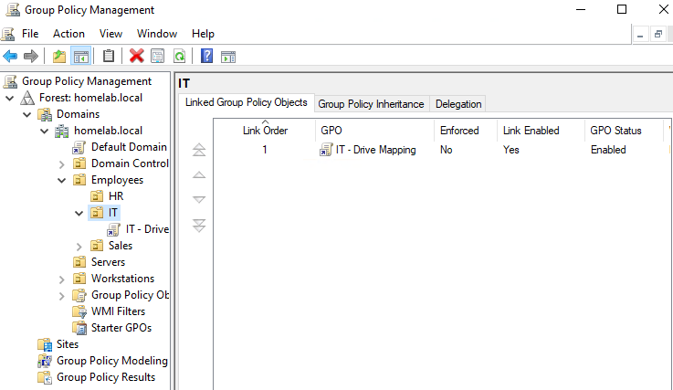
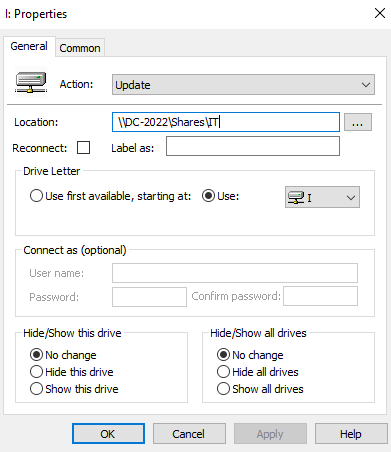
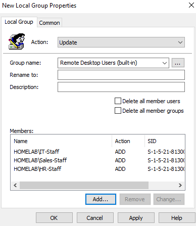
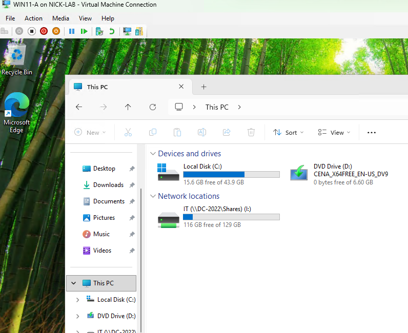
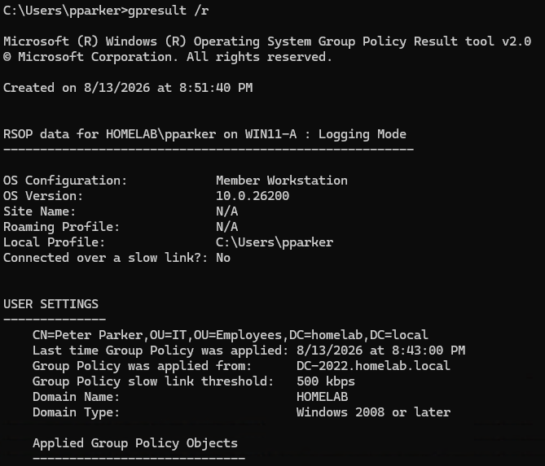
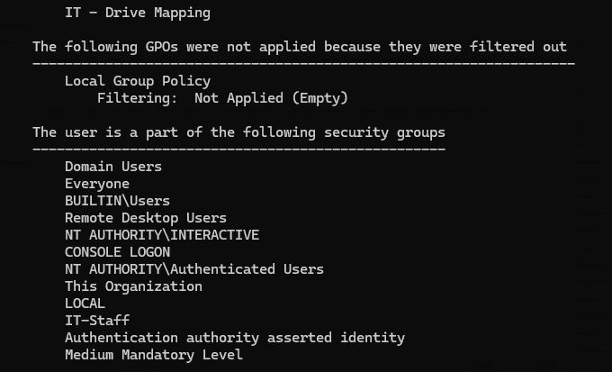

# Step 14: Group Policy Objects

## Goal
To push centrally managed settings to workstations and users via Group Policy, instead of configuring each machine by hand. Also covering a small set of realistic policies such as a password policy, drive mapping, and restricting Remote Desktop rights (relating back to the RDP issue from the previous step).

## Environment
- DC: `DC-2022`, `homelab.local`
- OU structure: Employees (IT/Sales/HR), Workstations Servers (see [12-organizational-units](../12-organizational-units/README.md))
- Shares: `\\DC-2022\Shares\...` per department (see [13-file-server-shares](../13-file-server-shares/README.md))

## Steps

### Create and link a GPO for drive mapping
1. Server Manager --> **Tools --> Group Policy Management**
2. Right clicked the **IT** OU --> **Create a GPO in this domain, and Link it here**
3. Named it `IT - Drive Mapping`
4. Right clicked it --> **Edit**, opening the Group Policy Management Editor
5. Navigated **User Configuration --> Preferences --> Windows Settings --> Drive Maps**
6. Right click --> New --> Mapped Drive:
   - Location: `\\DC-2022\Shares\IT`
   - Drive letter: `I:`
   - Action: **Update**
7. Closed the editor
8. Repeated same steps for **Sales** and **HR** departments

### Create a GPO for Remote Desktop access (relating to Step 13's issue)
9. Right clicked the **Workstations** OU --> Create and link a new GPO, named `Workstations - RDP Access`
10. Edited it --> **Computer Configuration --> Preferences --> Control Panel Settings --> Local Users and Groups**
11. New --> Local Group --> selected **Remote Desktop Users (built-in)** --> Action: **Update** --> Add --> ... --> typed IT-Staff --> Check Names --> OK
12. Added HR-Staff and Sales-Staff the same way
13. This solves the problem from [13-file-server-shares](../13-file-server-shares/README.md)
    - Instead of adding pparker to Remote Desktop Users one machine at a time, this GPO applies to every computer in the Workstations OU automatically

### Create a domain password policy
14. Learned that the **Default Domain Policy** governs password policy domain wide, and password policy can't be set at a normal OU level through a regular GPO, it only applies at the domain root
15. For this lab, edited the **Default Domain Policy** directly:
    - **Computer Configuration --> Policies --> Windows Settings --> Security Settings --> Account Policies --> Password Policy**
16. Set:
    - Minimum password length: 10
    - Password must meet complexity requirements: Enabled
    - Maximum password age: 60 days

### Apply and verify
15. On `WIN11-A`, ran:
      ```powershell
      gpupdate /force
      ```
      to pull the new policies immediately instead of waiting for the default background refresh interval

16. Logged in as `pparker` (via Basic Session, per the fix from Step 13)
17. Confirmed the `I:` drive appeared automatically, mapped to `\\DC-2022\Shares\IT`
18. Confirmed `pparker` could now connect via Enhanced Session/RDP without the earlier "Other user" error, proving the Remote Desktop Users GPO applied correctly
19. Verified policy application directly with:
      ```powershell
      gpresult /r
      ```
      which lists exactly which GPOs applied to the current user/computer, useful for confirming

## Why GPO Preferences vs GPO Policies (drive map / local group) 
GPO Preferences are used for flexible configurations such as mapped drives and local group membership, and can be targeted to specific users or computers. Unlike Policies, Preferences can be changed or removed by the user after they are applied, while Policies are enforced and can't be easily overridden.

## Issues encountered
Tried logging into `pparker` on WIN11-A via Enhanced Session mode before doing `gpupdate /force`. I switched to a basic session to login, then did the command, and then was able to switch to Enhanced Session mode.

## Result
Three GPOs are now in place. Drive mapping for IT-Staff/Sales-Staff/HR-Staff, Remote Desktop access for the Workstations OU, and a domain wide password policy. Verified with `gpresult /r` that policies are actually applying, not just configured. This also fixes the RDP-access problem from Step 13 by solving it at scale via policy instead of just a local fix. In the next step, I will be adding a second domain controller for redundancy (see
[15-second-domain-controller](../15-second-domain-controller/README.md)).

<br>

**New GPO linked to IT OU in Group Policy Management:**
<br>


**Drive Maps preference configuration:**
<br>


**Remote Desktop Users local group GPO configuration:**
<br>


**Mapped I: drive visible in File Explorer after gpupdate:**
<br>


**gpresult /r output showing applied GPOs:**
<br>

<br>

