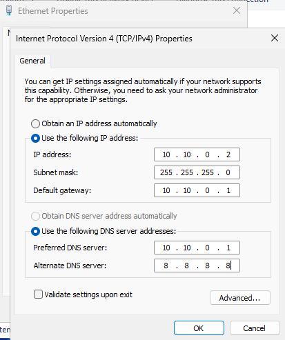
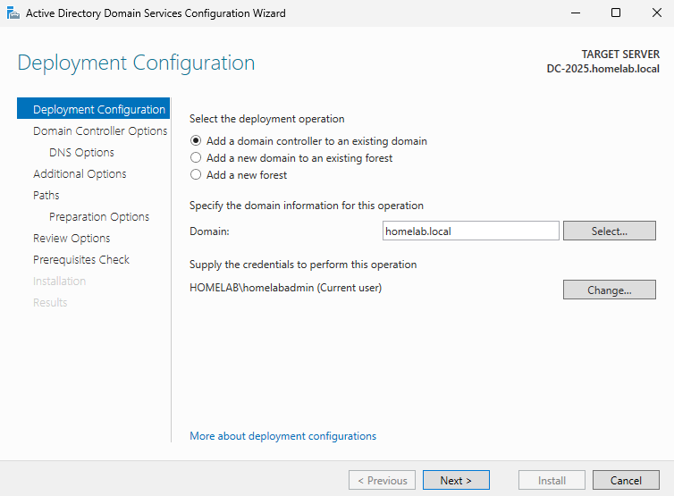
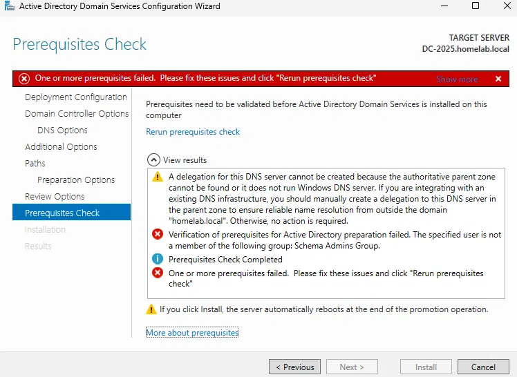
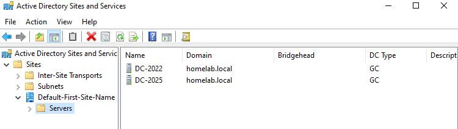
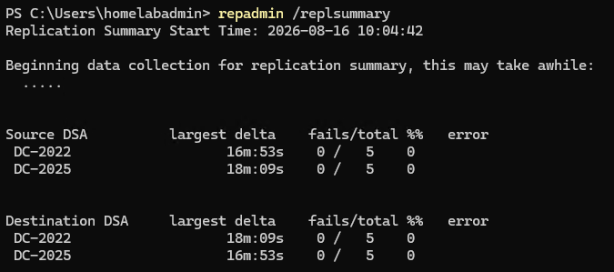

# Step 15: Adding a Second Domain Controller (Server 2025)

## Goal
Promote a second server to domain controller, joining the existing homelab.local forest, providing redundancy so AD/DNS keep functioning if DC-2022 goes down, and demonstrating multi-DC replication concepts.

## Environment
- Existing DC: `DC-2022` (Windows Server 2022), homelab.local (see [06-active-directory-promotion](../06-active-directory-promotion/README.md))
- New VM: Windows Server 2025 Evaluation
- Network: int-net (10.10.0.0/24)

## Steps

### Create the new VM
1. Hyper-V Manager --> New --> Virtual Machine
2. Name: `DC-2025`
3. Generation: **Generation 2**
4. Memory: **4096 MB**, Dynamic Memory enabled
5. Networking: connected to **int-net**
6. Virtual hard disk: new disk, 60 GB
7. Installation: pointed to Windows Server 2025 Evaluation ISO

### Install the OS
8. Installed Windows Server 2025 Standard Evaluation (Desktop Experience)
   - Same process as Step 4 (edition selection, custom install, set local Admin password)

### Static IP and rename (before joining the domain)
9. Set a static IP on the int-net adapter:
   - IP address: `10.10.0.2`
   - Subnet mask: `255.255.255.0`
   - Default gateway: `10.10.0.1` (pointing to DC-2022) (DC-2025 needs a gateway since it has no direct internet facing adapter of its own)
   - Preferred DNS: `10.10.0.1` (pointing to DC-2022 because DC-2025 needs to point at an existing DC's DNS to find the domain, not itself yet)
   - Alternate DNS: `8.8.8.8` (Google's public DNS, used as a fallback for anything the DC's DNS doesn't know)
10. Renamed the computer to `DC-2025` and restarted

### Join the existing domain (as a member server, before promotion)
11. Right clicked Start --> System --> Rename this PC (advanced) --> Domain: `homelab.local`
12. Entered `homelabadmin` credentials, got the welcome message, and restarted
13. Confirmed via ADUC that `DC-2025` appeared under the **Computers** container
    - Not the Domain Controllers one yet, since that only happens after promotion)

### Install AD DS and promote
14. Server Manager --> Manage --> Add Role and Features --> **Active Directory Domain Services**, installed
15. Clicked on the flag in the top left --> Promote this server to a domain controller --> **Add a domain controller to an existing domain**
    - Different option than DC-2022's original "Add a new forest"
16. Selected domain: `homelab.local`, supplied `homelabadmin` credentials
17. Confirmed **DNS server** and **Global Catalog** options checked
    - Global Catalog matters for a multi-DC forest so it can respond to AD searches and provide info about objects in the forest
18. Set DSRM password (separate from DC-2022)
19. Set replication source to `DC-2022`
20. **Prerequisites check failed**: "The specified user is not a member of the following group: Schema Admins Group."
    - Paused here rather than proceeding, see Issues Encountered for full explanation and fix
21. After adding `homelabadmin` to Schema Admins and logging off and on to refresh, reran the wizard from the start and Prerequisites check passed this time
22. Completed the wizard, server rebooted
23. Removed `homelabadmin` from Schema Admins immediately after promotion completed successfully
  
### Post-promotion: update DNS to point at itself
24. Updated DC-2025's own preferred DNS to `127.0.0.1` (itself), with `10.10.0.1` (DC-2022) as the alternate
    - This is so DC-2025 can independently provide DNS services and remain functional if DC-2022 becomes unavailable

### Verify replication
25. On DC-2022, opened **Active Directory Sites and Services** --> confirmed `DC-2025` appears as a server under Default-First-Site-Name
26. Created a test user on DC-2022, waited shortly, checked ADUC on DC-2025, and confirmed the user appeared there too
27. Ran `repadmin /replsummary` from either DC (I did DC-2025) to check replication health directly:
      ```powershell
      repadmin /replsummary
      ```

## Why Global Catalog and DNS both matter during this step
Global Catalog lets a DC answer forest wide search queries without contacting every domain in a multi-domain forest. This isn't really necessary in a single domain lab, but it's default best practice on every DC. Running DNS on both DCs means either can go down without breaking name resolution for the rest of the network, which is the actual redundancy benefit this step exists to demonstrate. 
 
## Issues Encountered
The DC-2025 VM was not starting properly, it froze at the "Press any key to boot..." screen. Had to restart the VM multiple times in order to start the OS installation. 

<br>

**DNS delegation warning**, identical to the one hit during DC-2022's original promotion from Step 6: "A delegation for this DNS server cannot be created because the authoritative parent zone cannot be found." This is expected for any DC in this lab, since homelab.local has no real parent DNS zone on the public internet to delegate from. There's no action required here and I was able to just continue the wizard.

<br>

**Prerequisites check failure - Schema Admins.** Promotion failed with "The specified user is not a member of the following group: Schema Admins Group." This happened because DC-2025 (Server 2025) is a newer OS version that the existing DC-2022 (Server 2022). Promoting a DC with a newer Schema version into an existing forest requires a one time Schema extension, which only Schema Admins can perform.

**Fix:** added `homelabadmin` to Schema Admins, logged off and on to refresh since group membership changes require a fresh logon. Re-ran the promotion wizard from the start and it passed prerequisites. Removed `homelabadmin` from Schema Admins immediately after promotion completed, since it was intended to be only temporary. 

## Result
`DC-2025` is a second, fully replicating domain controller for homelab.local, running DNS and Global Catalog. Verified with a live replication test (new object created on one DC, appeared on the other) and `repadmin /replsummary`. The domain now has DC-level redundancy, so if DC-2022 goes offline, DC-2025 can continue serving authentication, DNS, and directory queries for the rest of the lab. This completes the core infrastructure build. 

<br>

**Static IP configuration on DC-2025's int-net adapter:**
<br>


**Deployment Configuration Wizard showing adding to homelab.local:**
<br>


**Prerequisites check showing Schema Admins failure:**
<br>


**Active Directory Sites and Services showing DC-2022 and DC-2025:**
<br>


**repadmin /replsummary output confirming healthy replication:**
<br>

